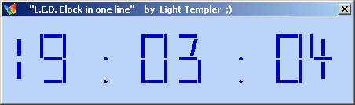



## L\.E\.D clock \- In one line and ONE command\! ;\)

### Description

Stop! Before taking Ulli to the winner: A L.E.D. clock in one line of VB code and only ONE command! ;))) Putting the focus onto the 'Visual' in our beloved programming enviroment VB I got another solution. (Plz don't kill me for it :))) ) Light Templer
 
### More Info
 

             |
---                |---
**Submitted On**   |1998-05-14 18:55:12
**By**             |[Light Templer](https://github.com/Planet-Source-Code/PSCIndex/blob/master/ByAuthor/light-templer.md)
**Level**          |Advanced
**User Rating**    |3.9 (35 globes from 9 users)
**Compatibility**  |VB 5\.0, VB 6\.0
**Category**       |[Complete Applications](https://github.com/Planet-Source-Code/PSCIndex/blob/master/ByCategory/complete-applications__1-27.md)
**World**          |[Visual Basic](https://github.com/Planet-Source-Code/PSCIndex/blob/master/ByWorld/visual-basic.md)
**Archive File**   |[L\_E\_D\_cloc1841141182005\.zip](https://github.com/Planet-Source-Code/light-templer-l-e-d-clock-in-one-line-and-one-command__1-58354/archive/master.zip)

